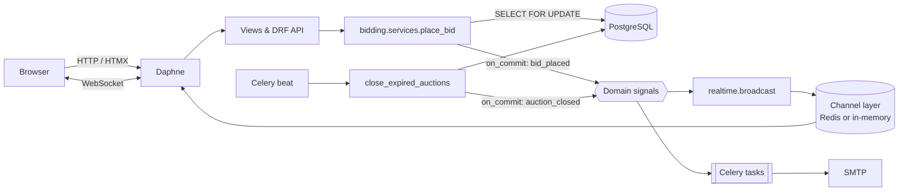

# BidStream

[](https://github.com/ebrahimmorkas/bidstream/actions/workflows/ci.yml)


**BidStream** is a real-time online auction platform built with **Django**, **Django Channels**
and **HTMX**. Sellers list items. Bidders compete live, and every bid is pushed over WebSockets
to everyone watching. Celery closes auctions on schedule and emails outbid notices and results.

The interesting engineering is in the parts that break under load: **two bids arriving at the
same moment**, **last-second "sniping"**, **fan-out of live updates across server processes**,
and **closing auctions exactly once**.

---

## Features

- **Live bidding:** price, bid count, history and countdown update instantly on every open tab
- **Concurrency-safe bids:** the auction row is locked (`SELECT ... FOR UPDATE`) during validation, and a unique constraint backs it up; a 10-thread race test proves it
- **Anti-sniping:** a bid in the final N minutes extends the auction, and the countdown follows the new end time in real time
- **Reserve prices:** hidden minimums; the API exposes only `reserve_met`
- **Auction lifecycle:** upcoming → live → closed or cancelled, with the winner decided atomically and idempotently
- **Notifications:** outbid alerts and winner/seller result emails, all sent after commit by Celery
- **HTMX UI:** filters and search without page reloads, an in-place bid panel and a watchlist toggle, all of which still work without JavaScript
- **REST API:** token auth, filtering, rate-limited bidding and OpenAPI/Swagger docs
- **Privacy:** bidder names are masked in public histories (`j***y`)

## Tech stack

| Layer | Technology |
| --- | --- |
| Web | Django 6, Django templates, HTMX, vanilla JS (WebSocket client) |
| Real-time | Django Channels 4, Daphne (ASGI), Redis channel layer *(optional)* |
| Async jobs | Celery 5 + beat *(Redis optional)* |
| API | Django REST Framework, django-filter, drf-spectacular |
| Data | PostgreSQL *(SQLite fallback)* |
| Quality | pytest, pytest-django, pytest-asyncio, factory_boy, Ruff, GitHub Actions |
| Ops | Docker (multi-stage, non-root), docker-compose |

## Architecture



Bidding and closing emit **domain signals after the transaction commits**. The real-time and
notification apps subscribe to them, so the bidding code doesn't depend on WebSockets or email.

```
apps/
├── accounts/       # email login, public display name, masking
├── auctions/       # Auction/Category/Watch, browse & manage views, closing service + task
├── bidding/        # Bid model, place_bid service (locking, anti-sniping), HTMX panel
├── realtime/       # Channels consumers, routing, broadcast of domain events
├── notifications/  # Celery email tasks wired to domain signals
├── api/            # DRF endpoints + OpenAPI
└── core/           # home, health check, seed_demo
```

## Redis is optional

| Variable | Set | Not set |
| --- | --- | --- |
| `DATABASE_URL` | PostgreSQL | SQLite |
| `REDIS_URL` | Redis cache, **Redis channel layer** (WebSockets across processes), Celery broker | Local-memory cache, in-memory channel layer, Celery tasks run eagerly |

Without Celery beat, expired auctions still close: lazily when someone opens them, or with
`python manage.py close_auctions` from cron. CI runs the full suite in **both** configurations.

## Getting started

### Local (no Docker, no Redis)

```bash
python -m venv .venv && source .venv/bin/activate   # Windows: .venv\Scripts\activate
pip install -r requirements-dev.txt
cp .env.example .env
python manage.py migrate
python manage.py seed_demo      # demo users + 6 live auctions with bids
python manage.py runserver      # Daphne: HTTP + WebSockets
```

Open <http://localhost:8000>, log in as `alice@bidstream.dev` / `demo-pass-123` in one browser
and `bobby@bidstream.dev` in another, then bid against yourself and watch both update live.

### Docker (PostgreSQL + Redis + worker + beat)

```bash
docker compose up --build
docker compose exec web python manage.py seed_demo
```

## REST API

Interactive docs: <http://localhost:8000/api/v1/docs/>

```bash
TOKEN=$(curl -s -X POST localhost:8000/api/v1/auth/token/ \
  -d "username=alice@bidstream.dev&password=demo-pass-123" | jq -r .token)

curl -s "localhost:8000/api/v1/auctions/?phase=live&ordering=-bid_count"
curl -s -X POST localhost:8000/api/v1/auctions/1/bids/ \
  -H "Authorization: Token $TOKEN" -H "Content-Type: application/json" -d '{"amount": "1500.00"}'
```

| Method | Endpoint | Notes |
| --- | --- | --- |
| `POST` | `/api/v1/auth/token/` | Obtain an auth token |
| `GET` | `/api/v1/auctions/` | Filters: `phase`, `category`, `min_price`, `max_price`; `search`; `ordering` |
| `GET` | `/api/v1/auctions/{id}/` | Includes `minimum_next_bid`, `reserve_met`, `phase` |
| `GET` | `/api/v1/auctions/{id}/bids/` | Paginated, masked bidders |
| `POST` | `/api/v1/auctions/{id}/bids/` | `201` created · `401` unauthenticated · `409` rejected by rules · rate-limited |

### WebSocket events

| Endpoint | Event | Payload |
| --- | --- | --- |
| `/ws/auctions/<id>/` | `bid` | `amount`, `bidder`, `current_price`, `minimum_next_bid`, `bid_count`, `ends_at`, `extended`, `leader_id` |
| `/ws/auctions/<id>/` | `closed` | `sold`, `winner`, `final_price` |
| `/ws/feed/` | `bid` | Same as above, for every auction (powers the listing price ticker) |

Clients can send `{"type": "ping"}` and receive `{"type": "pong"}`. Unknown auctions close the socket with code `4404`.

## Design decisions

**Why lock the auction row?** Placing a bid means reading the current price, validating, and
writing a new price. Without a lock, two bidders could both validate against $100 and both "win"
at $101. `place_bid` runs `SELECT ... FOR UPDATE` on the auction, so concurrent bids are
serialised and the second one is validated against the first one's price. A `(auction, amount)`
unique constraint is the final safety net. `test_concurrency.py` sends 10 identical simultaneous
bids and asserts exactly one is accepted.

**Why are WebSockets push-only?** Bids go over HTTP, so validation, CSRF, authentication and rate
limiting live in one place. That also makes consumers stateless and cheap to scale horizontally
behind the Redis channel layer.

**Why broadcast on commit?** If a broadcast ran inside the transaction and the transaction then
rolled back, clients would show a bid that never existed. Using `transaction.on_commit` means
only persisted state is ever pushed or emailed.

**Closing exactly once.** The beat task, the cron command and the lazy close-on-view all call
`close_auction`, which locks the row, re-checks `status` and `ends_at` (an anti-sniping
extension may have happened in between), and is a no-op on the second call.

## Testing

```bash
pytest                       # SQLite, in-memory channel layer, eager Celery
pytest --cov                 # coverage report
DATABASE_URL=postgres://... REDIS_URL=redis://... pytest   # PostgreSQL + Redis (CI)
```

Tests include WebSocket consumer tests (`channels.testing.WebsocketCommunicator`), service-level
rule tests, HTMX fragment tests, API tests and a PostgreSQL concurrency test.

## Configuration

| Variable | Default | Purpose |
| --- | --- | --- |
| `BIDSTREAM_ANTI_SNIPE_MINUTES` | `2` | Extension window for late bids |
| `BIDSTREAM_MIN_AUCTION_MINUTES` / `BIDSTREAM_MAX_AUCTION_DAYS` | `5` / `30` | Allowed auction length |
| `BIDSTREAM_MAX_BID` | `1000000` | Upper bound per bid |
| `BIDSTREAM_CLOSE_INTERVAL_SECONDS` | `15` | Beat schedule for closing auctions |
| `THROTTLE_BIDS` | `30/min` | API bid rate limit |
| `SITE_URL` | `http://localhost:8000` | Absolute links in emails |

## License

MIT
